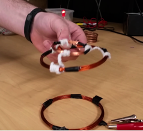
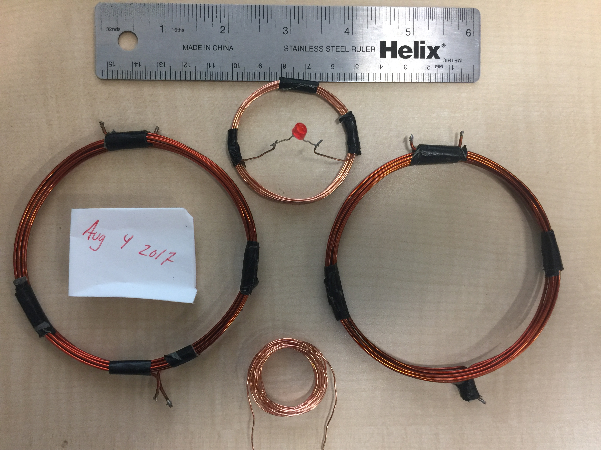

## 2017 Experimental Refresh
  

  

Overall, this experiment is harder than it looks, but easy when it works.  

The two SCMR coils in the photo above consist of 7 turns of 17 AWG wire with a diameter of 3.25 inches, along with an additional single-loop coil of the same diameter, fastened together with electric tape. The transmitting coil in the very top photo is being driven via induction through the single loop coil, which is attached directly to a standard testbench function generator (zero additional amplification). An amplifier can be designed to provide enough gain to wirelessly power a low-energy microprocessor (or charge a battery, etc). In fact, our original proposal was to develop a lightweight indoor drone, capable of continuous sustainable flight. See the [PDF](SCMR4EmbdSys.pdf) for additional info on the system (Design III).  

The smaller coil soldered to the LED has a diameter of 2 inches and is approximately 10 turns. The guage of wire is finer - 22 AWG (if memory serves correct). The smaller spool of 22 AWG at the bottom was used during testing. Also note that from the way the SCMR coils were wrapped, it is easy to distinguish the 7 turn coil ends from the single turn coil ends.  

In addition to the materials mentioned, some aerosol adhesive is useful to maintain the larger coils' shape, as minute changes alter the capacitances and resulting resonant frequencies. Sandpaper is useful to remove the insulating coating from the wire ends. PVC pipe was used to wrap and shape the coils - our local hardware store's supply ultimately decided our design's resonant frequency. __Please do__ notify the nearest adult of your intent to build, as the materials required may initially appear hazardous to the untrained eye.

Also note the lead capacitances of the driving alligator clips affect the transmitting coil's resonant frequency - the receiving coil's design should be altered accordingly (offset with an equivalent capacitance) if necessary. The single-loop coil fastened with the receiving coil is unused in this instance, but is still included to aid in matching the coils to one another.   

To measure the resonant frequency of a coil, attach the function generator to the ends of the single loop coil and oscilloscope leads to the ends of the 7 turn coil. Slowly increase the frequency on the generator and observe the frequency that peaks on the oscilloscope. When performed correctly, the peaks of the waveform will likely be cutoff, as they'll be beyond the scale that most standard testbench oscilloscopes can display. Again, note that the resonant frequency measured will differ from the true frequency, as this is a result of the added capacitance from the oscilloscope leads.   

Photo of our unfinished drone from 2014 (upcoming if I can find it ...)

## Tutorial Videos
There are also two tutorial videos we made for our original 2014 presentation (the very top photo was cropped from one of these videos). 
If you try the experiment above and are unable to acheive a working solution, simply contact the authors for a copy.

